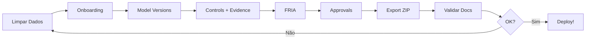

# 🧪 GUIA RÁPIDO DE TESTES - AIMS STUDIO

**Status:** ✅ Sistema 100% pronto para testes  
**Versão:** 1.0.0  
**Data:** October 21, 2025

---

## 🚀 INÍCIO RÁPIDO

### 1️⃣ Iniciar Sistema

```bash
# Terminal 1 - Backend
cd /Users/fabio/Desktop/foundry/backend
source .venv/bin/activate
SECRET_KEY=dev-secret-key uvicorn app.main:app --reload --port 8001

# Terminal 2 - Frontend
cd /Users/fabio/Desktop/foundry/frontend
npm run dev
```

**Acesse:** http://localhost:3000

---

### 2️⃣ Fazer Teste Completo

**Siga o guia detalhado:**
📄 **`TESTE_GUIADO_COMPLETO.md`** (776 linhas, ~50 min)

**Inclui:**
- Onboarding completo (5 steps)
- Model Versioning (criar versões)
- Controls & Evidence (upload + linking)
- FRIA (20 questões + campos estendidos)
- Approvals (submit/approve/reject)
- Export ZIP (15 documentos + manifest)
- Validação (zero placeholders)

---

### 3️⃣ Limpar Dados (Reset)

**Método rápido:**
```bash
cd /Users/fabio/Desktop/foundry/backend
python reset_data.py --yes
```

**Guia completo:**
📄 **`RESET_COMPLETO.md`** (detalhes + troubleshooting)

---

## 📚 DOCUMENTAÇÃO DISPONÍVEL

### Testes:
- 📄 `TESTE_GUIADO_COMPLETO.md` - Roteiro passo-a-passo
- 📄 `RESET_COMPLETO.md` - Como limpar todos os dados

### Produto:
- 📄 `PRODUCT_READY.md` - Documentação completa
- 📄 `IMPLEMENTATION_CHECKLIST.md` - Checklist de features

### Desenvolvimento:
- 📄 `AUDIT_GRADE_READY.md` - Checklist audit-grade
- 📄 `VALIDATION_GUIDE.md` - Guia de validação

---

## ✅ CHECKLIST PRÉ-TESTE

Antes de começar os testes, verifique:

- [ ] Backend rodando em http://localhost:8001
- [ ] Frontend rodando em http://localhost:3000
- [ ] Banco de dados limpo (ou use `reset_data.py`)
- [ ] localStorage limpo (F12 → Console → `localStorage.clear()`)

---

## 🎯 FEATURES PARA TESTAR

### Core Features (10/10):
1. ✅ Onboarding Wizard (5 steps)
2. ✅ Model Versioning (UI panel)
3. ✅ Controls Management (43 ISO controls)
4. ✅ Evidence Management (upload + SHA-256 + versioning)
5. ✅ FRIA Wizard (20+ questions + extended fields)
6. ✅ Document Approvals (submit/approve/reject)
7. ✅ Blocking Issues (6 types)
8. ✅ ZIP Export (manifest + hashes)
9. ✅ Document Generation (15 docs)
10. ✅ EU Database Status

### Documentos (15/15):
1. Risk Assessment
2. FRIA / Impact Assessment (NOVO template 15)
3. Model Card (com versions)
4. Data Sheet
5. Logging Plan
6. Post-Market Monitoring
7. Human Oversight SOP
8. Appeals Flow
9. Statement of Applicability
10. Policy Register (fixed placeholders)
11. Audit Log
12. Annex IV Technical Documentation
13. Instructions for Use
14. GPAI Transparency Notice
15. FRIA Document (gerado)

---

## 🧹 RESET RÁPIDO

**1 comando para limpar tudo:**

```bash
cd /Users/fabio/Desktop/foundry/backend && python reset_data.py --yes && echo "✅ Backend limpo"
```

**No navegador (F12 → Console):**
```javascript
localStorage.clear(); sessionStorage.clear(); location.reload();
```

---

## 📊 TESTES AUTOMATIZADOS

```bash
cd /Users/fabio/Desktop/foundry/backend
source .venv/bin/activate

# Rodar todos os testes
pytest tests/test_document_context.py \
       tests/test_document_generation_integration.py \
       tests/test_annex_iv_generation.py \
       tests/test_evidence_citations.py \
       tests/test_instructions_for_use.py \
       tests/test_gpai_transparency.py \
       tests/test_evidence_versioning.py \
       tests/test_e2e_audit_grade.py \
       tests/test_zip_manifest.py \
       tests/test_approvals_workflow.py \
       --tb=no -q
```

**Esperado:** 20/20 passing ✅

---

## 🎬 WORKFLOW TÍPICO DE TESTE



---

## 💡 DICAS RÁPIDAS

### Para Testar Rápido (10 min):
1. Onboarding básico (Step 1-2)
2. Criar 1 versão do modelo
3. Adicionar 2-3 controles
4. Upload 1 evidência
5. Exportar ZIP
6. Verificar 1 documento

### Para Teste Completo (50 min):
- Siga `TESTE_GUIADO_COMPLETO.md` inteiro

### Para Demo ao Cliente (25 min):
- Siga apenas Partes 1-6 do guia
- Skip validação detalhada
- Foco em funcionalidades

---

## 🐛 TROUBLESHOOTING RÁPIDO

**Backend não inicia:**
```bash
cd backend
source .venv/bin/activate
pip install -r requirements.txt
alembic upgrade head
```

**Frontend não inicia:**
```bash
cd frontend
rm -rf .next node_modules
npm install
npm run dev
```

**Dados não aparecem:**
```javascript
// Console do navegador
localStorage.clear();
location.reload();
```

**Testes falhando:**
```bash
cd backend
rm aims.db
alembic upgrade head
pytest --tb=short
```

---

## 📞 SUPPORT

**Problemas?** Verifique:
1. Backend logs: `tail -f backend/logs/api.log`
2. Browser console: F12 → Console
3. Network tab: F12 → Network
4. Database: `sqlite3 backend/aims.db ".tables"`

---

## 🎉 APÓS TESTES COMPLETOS

Se todos os testes passarem:

✅ Sistema está **production-ready**  
✅ Pode fazer **deploy**  
✅ Pronto para **primeiro cliente**

---

## 🚀 PRÓXIMOS PASSOS

1. **Testes completos** (use guia)
2. **Deploy** (Railway + Vercel)
3. **Primeiro cliente piloto**
4. **Coletar feedback**
5. **Iterar**

---

**Boa sorte com os testes!** 🎯

---

**Criado por:** Cursor AI + Claude Sonnet 4.5  
**Commit:** 31a0bd4  
**Status:** ✅ Production Ready
